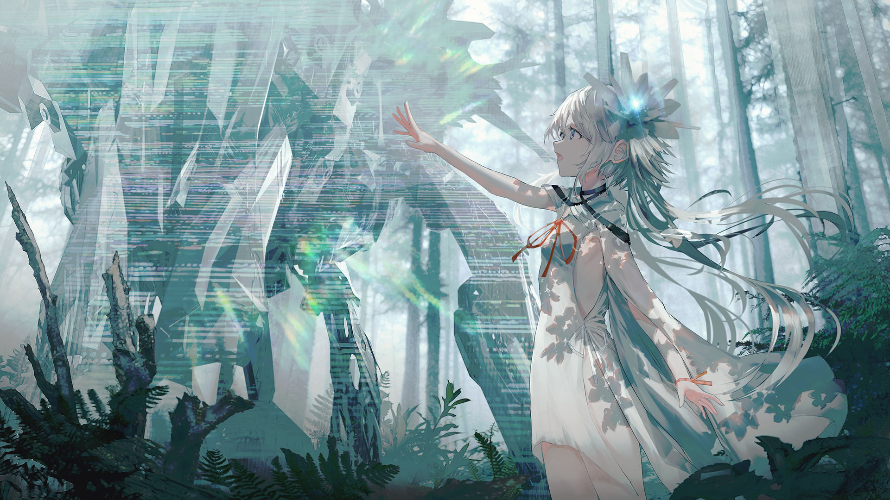
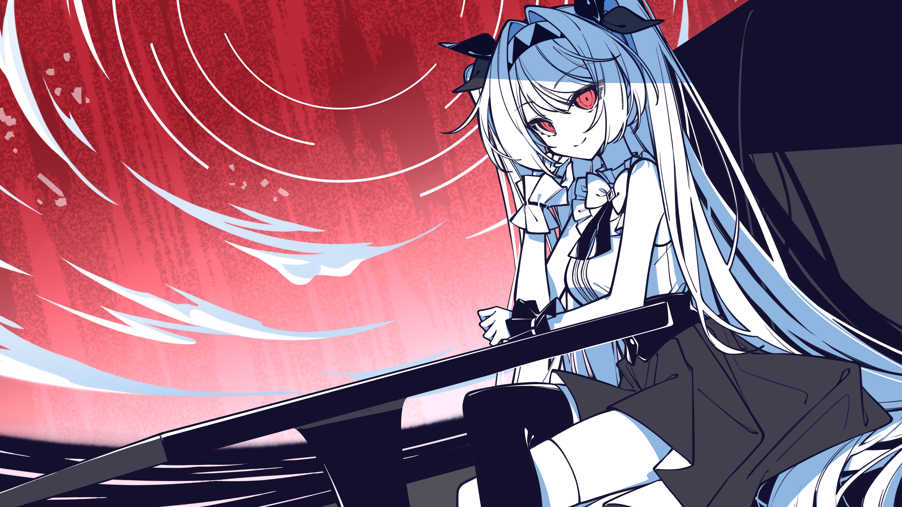

如果你写过纯文字小说，就会知道能控制读者的阅读速度，能用音乐调动读者的情绪，能用画面减少文字表达的缺失，是一件多么愉快的事情。换句话来说，VN仍然是小说，仍然以文字为核心，只是相对更丰富。

但如果你作为年轻人，没有经历过互联网兴起的时代，现在让你去玩Gal，你会感觉非常怪异——哪怕是最近几年的作品。

## 问题不在脚本

单论脚本，其实并没有多少问题。文学近几十年的发展并不算快，早期的Gal脚本在现在看来也并不过时。哪怕是看起来新颖的仿生人议题，其实1818年的《弗兰肯斯坦》就开始讨论了。而且在商业作品里，脚本只要看起来像回事就行了，大多数人并不会深究。

问题不出在小说，那就只能出在视觉上了。
## 视觉落后

**字体方面**，作为一种小说，字体自然是重要的，但令人意外的是，仍然有部分日厂在用宋体，如果你不懂效果有多差，你可以尝试使用一下。

**画质方面**，在各种3A游戏都在堆砌几十GB、几百GB的资源，用UE4、UE5追求更精致的画质的同时，Gal最大的进步竟然是部分作品从720p提升到了1080p，画风也十分复古，在美术资源需求量低，可复用性高的情况下，现在的改进速度令人费解。这也是《星之终途》虽然烂尾，但我仍然给了比较高评价的原因，至少在画师选择上在做创新。

**引擎方面**，其实Ren'Py的UI和转场并不能算特别难看，无功无过。但Gal本身并没有什么重资产，在技术上放到Unity或者Godot上做其实并不困难。这种更现代的引擎上限更高，更方便，性能开销现代pc也完全负担的起。值得一提的是大厂确实在做升级，只是升级的很慢，就像我不说你或许不会知道《星之终途》的引擎是升级过的。

**特效方面**，大部分人上的剪辑第一课都会教一个东西，最高级的手法就是硬切，除此之外，基础的黑场、白场、交叉溶解都挺好的。最忌讳的就是瞎用特效，尤其是跟画面根本不搭配的，比如ATRI戏水的特效，在二次元画风里冒出3d水，只是简单的推拉镜头更简单也更好。并且这种轻量的特效，应该能做的更好才对。

### 一个不恰当的例子

前些日子暴雷的《不存在的你和我》，虽然剧情是纯粹的无病呻吟，但UI和画风画质还是极好的。最后的销量也证明了，大多数人根本不在意脚本，毕竟这样的剧情还有人一本正经的做解析。

## 一个类比
现在的VN就像电影拍得很好，但坚持用4:3画幅和CRT色彩——就是要让你别扭。

## 小众市场的困境
但或许这就是小众市场的生存之道：改变不一定会成功，但不改变一定不会失败。

当你的受众群体本就有限，任何改变都可能失去现有用户，而新用户又不一定会因此进来。于是最安全的策略就是什么都不变，维持现状，至少不会死得更快。

只是这样一来，VN这个媒介的潜力就真的被浪费了。
